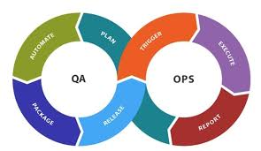

# QAOps для web-приложения 

Обеспечение качества и тестирование web-приложения с помощью способа QAOps. 
Нужно реализовать все шаги этого процесса, а именно планирование (plan), автоматизирование (automate),
упаковка (package), релиз (release), триггер (trigger), выполнение (execute), отчёт (report). 
Интегрировать все шаги QAOps в конвейер доставки программного обеспечения.
				

Используется приложение - Tic Tac Toe, которое является трех-платформенной (iOS, Android и Интернет)
многопользовательской онлайн-игрой. Можно играть в кроссплатформенную игру Tic Tac Toe.
Как онлайн, так и лично с друзьями. Не требуется от пользователей создания учетной записи.
Вместо этого используются анонимные идентификаторы лобби. Поэтому только пользователь и тот,
с кем он играет онлайн, знает, кто с кем играет.

Web-приложение: https://tictactoe.no/
Github репозиторий: https://github.com/andordavoti/tic-tac-toe-app
